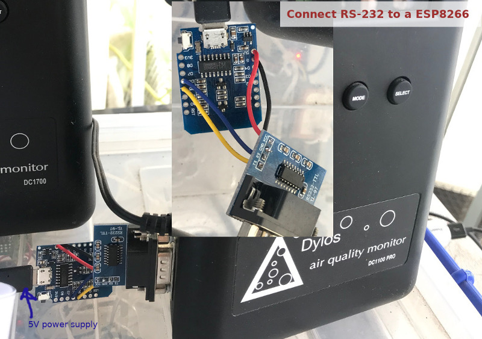

# Get Data from Dylos DC100 by ESP8266 
- Dylos DC1100 is a mid-range particle counter of suspended materials in the atmosphere 
- Data can be logged using a Dylos-provided software on Windows via a DB9-to-USB cable
- Data also can be read using a Python script from an attached computer
- ESP8622 can read the data from DB9 port and push the received data to a MQTT server
## Wiring
- Wiring ESP8266 with a RS-232 module

  

- How to code work in the terminal

  

## More info
- Have a look at this tutorial for the full implementation [link to tutorial](https://www.b-io.info/tutorials/wireless-RS232)
